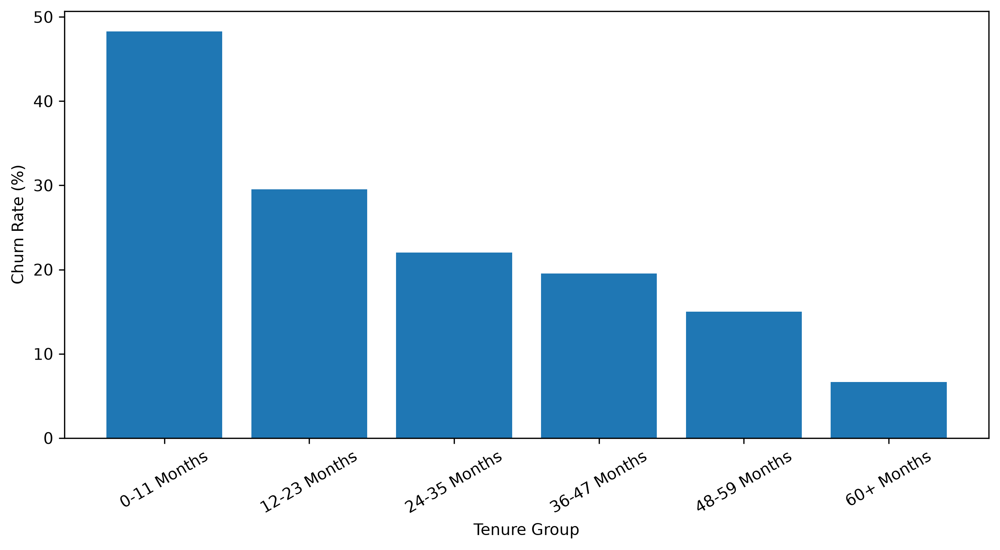
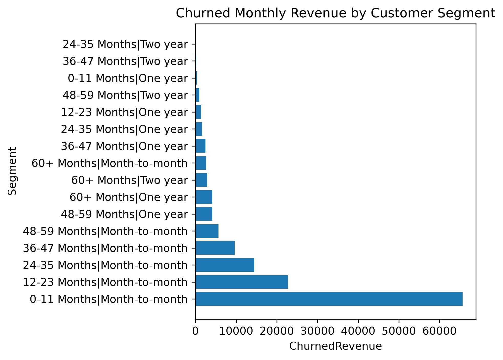
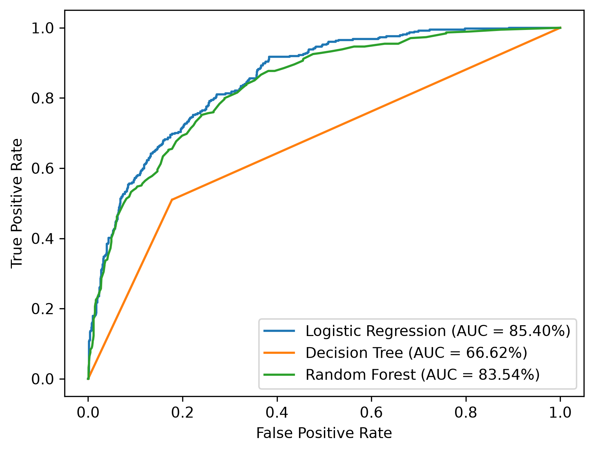
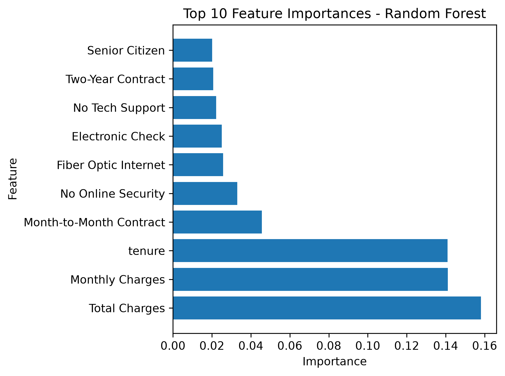
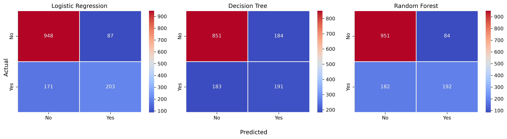

# Telco Customer Churn & Revenue Risk Analysis

## Executive Summary

Customer churn is a major business challenge for subscription-based companies because losing customers directly reduces recurring revenue.

This project analyzes customer churn behavior using the **Telco Customer Churn dataset** and combines exploratory data analysis with machine learning to identify customer segments associated with higher churn and quantify the monthly revenue associated with churned customers.

The analysis found that **26.54% of customers churned**, and customers who churned accounted for **30.50% of total monthly charges** in the dataset.

A particularly important segment was customers with **0–11 months of tenure on month-to-month contracts**. Churned customers within this segment accounted for **47.20% of total churned monthly revenue**. Within this segment, customers with monthly charges above the segment median of **$73.60** accounted for **30.39% of total churned monthly revenue**.

Three classification models were evaluated. Logistic Regression achieved an **85.40% ROC-AUC**, followed by Random Forest at **83.54%** and Decision Tree at **66.62%**.

The results can be used to support targeted customer-retention strategies and provide a foundation for deploying a churn-risk prediction system.

---

## Dataset

This analysis uses the **Telco Customer Churn** dataset (IBM sample data), published on Kaggle by BlastChar:
https://www.kaggle.com/datasets/blastchar/telco-customer-churn

- 7,043 customers, 21 columns (demographics, services, contract, billing, and a `Churn` target)
- The CSV is not committed to this repo. To reproduce the analysis, download `WA_Fn-UseC_-Telco-Customer-Churn.csv` from the link above and place it in the project root next to `telco_churn_analysis.py`.

---

## Business Problem

For a subscription-based telecommunications company, customer churn can reduce recurring revenue and increase the need to acquire replacement customers.

The business questions addressed in this project are:

* Which customer groups have higher observed churn rates?
* How much monthly revenue is associated with customers who churned?
* Which customer characteristics are important for predicting churn?
* Which customer segments should receive greater attention from retention efforts?
* Can machine learning help identify customers at risk of churn?

---

## Key Findings

### 1. Overall Churn

**26.54%** of customers in the dataset churned.

Customers who churned accounted for **30.50% of total monthly charges**.

This indicates that churn represents a meaningful portion of the company's recurring monthly revenue base.

---

### 2. Contract Type and Churn

Contract type showed substantial differences in observed churn rates:

| Contract Type  | Churn Rate |
| -------------- | ---------: |
| Month-to-month | **42.71%** |
| One year       | **11.27%** |
| Two year       |  **2.83%** |

Month-to-month customers had a substantially higher observed churn rate than customers on one-year or two-year contracts.

---

### 3. Early-Tenure Month-to-Month Segment

Customers were grouped by tenure and contract type to identify segments associated with churn.

The segment consisting of:

* **0–11 months tenure**
* **Month-to-month contract**
* **Churn = Yes**

accounted for **47.20% of total churned monthly revenue**.

Within this segment, the median monthly charge was **$73.60**.

Customers in this segment with monthly charges above $73.60 accounted for **30.39% of total churned monthly revenue**.

---

### 4. Monthly Charges and Churn

Average monthly charges differed between customers who churned and those who stayed:

| Customer Status | Average Monthly Charge |
| --------------- | ---------------------: |
| Churned         |             **$74.44** |
| Stayed          |             **$61.27** |

In this dataset, churned customers had a higher average monthly charge than customers who stayed.

This is an observed association and does not establish that higher charges cause customers to churn.

---

## Machine Learning

Three classification models were trained to predict whether a customer would churn.

### Data Preparation

The following preprocessing steps were performed:

* Converted `TotalCharges` from object to numeric format
* Replaced missing `TotalCharges` values with the median
* Removed `customerID` and the target variable `Churn` from the feature set
* Split the data into training and testing sets using an 80/20 stratified split
* Applied One-Hot Encoding to categorical variables
* Applied Standard Scaling to numerical variables

### Model Performance

| Model               |   Accuracy | Precision (Churn) | Recall (Churn) | F1-Score (Churn) |    ROC-AUC |
| ------------------- | ---------: | ----------------: | -------------: | ---------------: | ---------: |
| Logistic Regression | **81.69%** |           **70%** |        **54%** |          **61%** | **85.40%** |
| Decision Tree       |     73.95% |               51% |            51% |              51% |     66.62% |
| Random Forest       |     81.12% |           **70%** |            51% |              59% |     83.54% |

### Logistic Regression

Logistic Regression was used as the baseline classification model.

It correctly classified approximately **81.69% of test customers**.

Its **54% recall for the Churn class** means that it identified 54% of customers who actually churned in the test set.

Its **70% precision for the Churn class** means that approximately 70% of customers predicted as churners actually belonged to the Churn class.

The model achieved a **ROC-AUC of 85.40%**, indicating good ability to distinguish between customers who churned and those who stayed across different classification thresholds.

### Decision Tree

The Decision Tree achieved **73.95% accuracy** and a **66.62% ROC-AUC**.

Its churn precision, recall, and F1-score were all **51%**.

### Random Forest

The Random Forest achieved **81.12% accuracy** and an **83.54% ROC-AUC**.

It achieved **70% precision** and **51% recall** for the Churn class.

---

## Feature Importance

Random Forest feature importance was used to examine which processed features contributed most to the model's predictions.

The most important features included:

* Total Charges
* Monthly Charges
* Tenure
* Month-to-Month Contract
* No Online Security
* Fiber Optic Internet
* Electronic Check
* No Tech Support
* Two-Year Contract
* Senior Citizen

Feature importance indicates how much the model relied on these features when making predictions. It does not by itself establish a causal relationship between a feature and churn.

---

## Business Recommendations

### 1. Target High-Risk Early-Tenure Customers

Customers on month-to-month contracts with tenure under 12 months and monthly charges above **$73.60** represent **30.39% of total churned monthly revenue**.

These customers should be prioritized for targeted retention offers.

### 2. Encourage Longer-Term Contracts

Encourage month-to-month customers to consider longer-term contracts, as their observed churn rate was **42.71%**, compared with **11.27%** for one-year contracts and **2.83%** for two-year contracts.

The analysis shows an association between contract type and churn; it does not establish that switching contracts itself will cause churn to decrease.

### 3. Target High-Value Customers with Elevated Monthly Charges

Identify customers with higher monthly charges—especially those in early-tenure, month-to-month segments—and test targeted retention offers. Churned customers had a higher average monthly charge (**$74.44**) than customers who stayed (**$61.27**), although this analysis shows an association rather than proving that higher charges cause churn.

---

## Visualizations

### Churn Rate by Tenure



### Churned Monthly Revenue by Customer Segment



### ROC Curve Comparison



### Top 10 Random Forest Feature Importances



### Confusion Matrix Comparison



---

## Limitations

* The dataset is observational, so relationships identified in the analysis do not establish causation.
* `MonthlyCharges` represents recurring monthly charges and should not be interpreted as lifetime customer revenue.
* The revenue analysis measures monthly charges associated with churned customers rather than future revenue loss.
* Model evaluation was performed using a single train/test split.
* Model performance may differ when applied to new customer populations.
* The analysis identifies customers associated with higher churn risk but does not determine which retention intervention will successfully prevent churn.
* No controlled retention experiment was performed to measure the actual effect of retention offers.

---

## Next Steps

### 1. Deploy the Churn Prediction Model

Build a prediction service that accepts customer information and returns a churn probability.

### 2. Create Customer Risk Groups

Convert model predictions into actionable risk categories that can be used by retention teams.

**Customer Data → Churn Model → Churn Probability → Risk Group → Retention Action**

### 3. Build a Retention Dashboard

Create a dashboard showing:

* Number of high-risk customers
* Churn probability
* Contract type
* Tenure
* Monthly charges
* Customer segments
* Revenue associated with high-risk customers

### 4. Test Retention Strategies

Use targeted retention offers and measure whether they actually reduce churn.

Different customer segments could receive different interventions, allowing the business to evaluate which strategies produce measurable improvements.

### 5. Monitor Model Performance

After deployment, continuously monitor prediction performance and retrain the model when customer behavior or the underlying data changes.

---

## Project Structure

```text
Telco-Churn-Revenue-Risk-Analysis/
│
├── .gitignore
├── README.md
├── requirements.txt
├── telco_churn_analysis.py
│
├── churn_rate_by_tenure.png
├── churned_revenue_by_segment.png
├── roc_curve_comparison.png
├── top_10_features_importances.png
└── confusion_matrix.png
```

---

## Tools & Technologies

* Python
* Pandas
* Scikit-learn
* Matplotlib
* Seaborn

### Machine Learning

* Logistic Regression
* Decision Tree
* Random Forest
* One-Hot Encoding
* Standard Scaling
* ROC-AUC Evaluation

---

## Project Objective

The objective of this project is not only to predict customer churn, but to connect **customer behavior, revenue exposure, segmentation, and machine learning** to practical business-retention decisions.